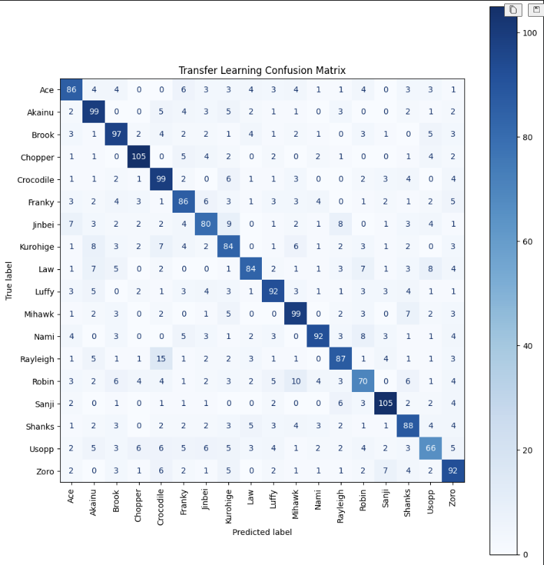

# Transfer Learning Model

## 1. Import libraries
````
import numpy as np
import tensorflow as tf
import matplotlib.pyplot as plt

from tensorflow.keras import models, layers
from tensorflow.keras.applications import EfficientNetB7
from tensorflow.keras.callbacks import ModelCheckpoint
````


## 2. Loading the Processed Dataset
```
train_img = np.load("train_img.npy")
test_img = np.load("test_img.npy")

train_labels = np.load("train_labels.npy")
test_labels = np.load("test_labels.npy")

class_names = np.load("class_names.npy", allow_pickle=True)

num_classes = len(class_names)
```

Instead of loading and preprocess all of the images again, we reuse the dataset that was generated in previous stages.
<br>
It has:

- Train Images
- Test images
- Train labels
- Test labels
- Class names
<br>
We use this preprocessed, train and test set that we used in our CNN stage, reusing the dataset reduces execution time and guarantees that all of the models are trained with the same data. 

## 3. Creating the Transfer Learning Model 

```
def get_model_transfer_learning(input_shape, num_classes):
    base_model = EfficientNetB7(
        weights="imagenet",
        include_top=False,
        input_shape=(224, 224, 3)
    )

    base_model.trainable = False

    model = models.Sequential([
        layers.Input(shape=input_shape),

        data_augmentation,

        layers.Resizing(224, 224),

        layers.Rescaling(255.0),

        base_model,

        layers.GlobalAveragePooling2D(),

        layers.Dense(128, activation="relu"),

        layers.Dropout(0.5),

        layers.Dense(num_classes, activation="softmax")
    ])

    return model


model_tl = get_model_transfer_learning(
    input_shape=(64, 64, 3),
    num_classes=num_classes
)

model_tl.summary()
```
Following the workflow that the authors from the paper we selected the next step was to implement transfer learning. The main difference with our CNN and this Transfer Learning model is that we implemented and used `EfficientNetB7` which is a pre trained model that was trained with millions of images and thousands of classes, it already knows how to detect thigs like "edges", "shapes", textures", "patterns", "object parts". 
<br>

### Freezing the Pretrained Model
`base_model.trainable = False` means that some layers were "frozen", this asures us that their weights are not modified, their visual knowledge remains intact and only new classification layers are trained. 


### Image Resizing
In our models we used "64 x 64 x 3" but utilizing those parameters it has no significant growth in accuracy so we have to resize them so EfficientNetB7 can extract more detailed visual features from the images, thats why we use `layers-Resizing(224,224)` so images convert before the images are processed by EfficientNetB7.


### Image Rescaling 
EfficientNetB7 expects pixel values that are closer to the original imahe range, with this we restore poxel values to 0-255 before it can extract features. 

### Global Average Pooling 
We use `layers.GlobalAveragePooling2D()` to convert those feature maps into a compact vector so the amount of data is able to pass through the other layers.

### Dense Classification Layer 
`layers.Dense(128, activation="relu")` this layer contains 128 neurons and has a sole purpose to learn the relationship between the features that EfficientNetB7 extracted about every class.

### Droput Regularization
With `layers.Dropout(0.5)` randomly disables 50% of the neurons during training, it can reduce overfitting, improves generalization and even prevents neuron co-adaption(it´s when several neurons are co-dependent with each other, it can cause overfitting).

### Output Layer 
The dataset has "18 classes" so we use `num_classes = 18` so the softmax layer produces a probability distribution of each and every class.


## 4. Model Compilation
```
#Compilamos el modelo 
model_tl.compile(
    optimizer=tf.keras.optimizers.Adam(learning_rate=0.0003),
    loss="sparse_categorical_crossentropy",
    metrics=["accuracy"]
)
```
After we create the model we compile it with adam but we altered some parameters, like de `learning_rate=0.0003` which is lower that the default, this value is common when implementing Transfer Learning so we can allow the classifier layers to learn more gradually without having high weight updates. The loss function was selected because our dataset has 18 classes that are represented by numeric labels [0, 1, 2, 3, 4, ..., 17].

## 5. Model Checkpoint 
```
checkpoint_tl = ModelCheckpoint(
    filepath="best_model_tl.keras",
    monitor="val_accuracy",
    save_best_only=True,
    verbose=1
)
```
During the training phase the model goes step by step in each epoch, here we only save the best version of the model monitoring the validation because it represents performance from images that were not seen during the training phase, and with this we can make predictions with the best model for evaluation and prediction.

## 6. Early stopping and Learning Rate Reduction
```
early_stop_tl = EarlyStopping(
    monitor="val_accuracy",
    patience=5,
    restore_best_weights=True,
    verbose=1
)

reduce_lr_tl = ReduceLROnPlateau(
    monitor="val_loss",
    factor=0.5,
    patience=3,
    min_lr=1e-6,
    verbose=1
)
```
When training starts to last hours we want to have the chance to reduce those times, with earlystopping we can stop the training phase when the model stops improving it not only reduces time but helps avoid overfitting.
<br>
When a model stops improving with `ReduceLROnPlateau` we make it learn at a slower pace so it´s adjustments are finer and achive better results.


## 7. Model Training
```
history_tl = model_tl.fit(
    train_img,
    train_labels,
    validation_split=0.2,
    epochs=30,
    batch_size=16,
    callbacks=[checkpoint_tl, early_stop_tl, reduce_lr_tl]
)
```
This is were the model learns from the images with our train, val and test split.

## 8. Evaluation Metrics
```
Accuracy
Precision
Recall
F1 Score
```

Based on the paper we chose we are evaluating using:
- Accuracy: That measures the percentage of correctly classified images.
- Precision: Measures how often the model made a correct class prediction.
- Recall: Tells us how many real examples we successfully detected.
- F1-Score: Combines Precision and Recall into a single value.

## Transfer Learning Results

| Metric | Value |
|---|---:|
| Accuracy | 68.61% |
| Precision | 68.78% |
| Recall | 68.61% |
| F1 Score | 68.52% |


## 9. Confusion Matrix
```
from sklearn.metrics import confusion_matrix
from sklearn.metrics import ConfusionMatrixDisplay

cm = confusion_matrix(
    test_labels,
    y_pred_classes
)

fig, ax = plt.subplots(figsize=(10,10))

disp = ConfusionMatrixDisplay(
    confusion_matrix=cm,
    display_labels=class_names
)

disp.plot(
    ax=ax,
    cmap="Blues",
    xticks_rotation=90
)

plt.title("Transfer Learning Confusion Matrix")
plt.tight_layout()
plt.show()
```

The confusion matrix helps us visualize which classes are being classified correctly and which classes may be confused with other classes, the diagonal shows correct predictions a high value means better performance, this is important because we can visualize all of our 18 classes with our 18 different characters.




## Conclusion 
The implementation of Transfer Learning with EfficientNetB7 showed a significant improvement compared to previous models. Overall transfer learning demonstrated that with a pretrained model we can substantially improve image classification performance comparing it with a CNN made from zero, this shows the papers results and baseline measurements so we can go on even further.


