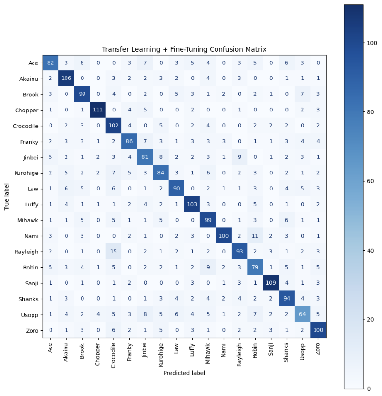

# Transfer Learning Model + Fine Tuning

## 1. Next Step
After implementing Transfer Learning the next step would be to implement Fine-Tuning like they did in the paper we chose.
<br>
In transfer learning we froze the EfficientNetB7 so only the custom layers would be trained, this allows the model to reuse visual knowledge tat it previously learned from ImageNet while still adapting to our dataset of One Piece characters. Even though transfer learning had very good results the pretrained features were from a very general dataset with thousands of object categories. With Fine-Tuning these limitations would be allowing a small portion of the pretrained network to continue learning from our dataset.


## 2. Libraries
```
import numpy as np
import tensorflow as tf
import matplotlib.pyplot as plt

from tensorflow.keras import models, layers
from tensorflow.keras.applications import EfficientNetB7
from tensorflow.keras.callbacks import ModelCheckpoint
from tensorflow.keras.callbacks import (EarlyStopping, ReduceLROnPlateau)
```

These are all the libraries needed to build, train, save and evaluate Fine-Tuning model.

## 3. Loading Processed Dataset

```
train_img = np.load("train_img.npy")
test_img = np.load("test_img.npy")

train_labels = np.load("train_labels.npy")
test_labels = np.load("test_labels.npy")

class_names = np.load("class_names.npy", allow_pickle=True)

num_classes = len(class_names)
```
We the load the dataset that was already processed in previous stages.


## 4. Data Augmentation
```
data_augmentation = tf.keras.Sequential([
    layers.RandomFlip("horizontal"),
    layers.RandomRotation(0.15),
    layers.RandomZoom(0.15),
    layers.RandomTranslation(0.1, 0.1),
    layers.RandomContrast(0.1),
])
```
Here we define the Data Agumentation pipeline so during training the model receives slightly modified versions of the original image.


## 5. Implementing Fine-Tuning
```
model_ft = tf.keras.models.load_model("best_model_tl.keras")

for i, layer in enumerate(model_ft.layers):
    print(i, layer.name, layer.trainable)

base_model = model_ft.layers[3]

base_model.trainable = True

for layer in base_model.layers[:-20]:
    layer.trainable = False

for layer in base_model.layers[-20:]:
    layer.trainable = True

trainable_count = 0

for layer in base_model.layers:
    if layer.trainable:
        trainable_count += 1

print("Trainable layers in EfficientNetB7:", trainable_count)
```
In the previous stage we already had a trained model so instead of creating a new model from scratch we loaded the best version so we could continue training whith information it already knows.
<br> 
Before we modify the model we have to see all of its layers to see where EfficientNetB7 is located inside the network, we store the EfficientNetB7 layer so we can access and modify the pretrained network without afecting the rest of the model.
<br>
`base_model.trainable = True` just by changin False to True we allow EfficientNetB7 to update its weights during training. EfficientNetB7 has hundreds of layers so we freeze most of them to keep the original ImageNet knowledge.
<br>
`for layer in base_model.layers[-20:]:
    layer.trainable = True` This line tells us that only the last 20 layers will be trained, by doing so the model will adapt its visual features to our OnePiece dataset and keep ImageNet knowledge.
<br> 
This was done because Fine-Tuning is applied to slightly adjust the learned features to the specific One Piece characters in the dataset. Retraining the whole datset would take many hours so thats why we only retrain the last layers.


## 6. Compile the model 
```
model_ft.compile(
    optimizer=tf.keras.optimizers.Adam(learning_rate=1e-5),
    loss="sparse_categorical_crossentropy",
    metrics=["accuracy"]
)
```
Then we must compile the model and the main thing here is `optimizer=tf.keras.optimizers.Adam(learning_rate=1e-5)` In Fine-Tuning we use a very small learning rate due to the knowledge of EfficientNetB7 and all it learned from ImageNet, we want the model to do minor adjustments so the model adapts better to the OnePiece dataset, if we don´t do this the model will just change to fast and forget what it knows.


## 7. Model Checkpoint and Train callbacks
```
checkpoint_tl = ModelCheckpoint(
    filepath="best_model_tl_ft.keras",
    monitor="val_accuracy",
    save_best_only=True,
    verbose=1
)


early_stop_tl = EarlyStopping(
    monitor="val_accuracy",
    patience=5,
    restore_best_weights=True,
    verbose=1
)

reduce_lr_tl = ReduceLROnPlateau(
    monitor="val_loss",
    factor=0.5,
    patience=3,
    min_lr=1e-6,
    verbose=1
)
```
We apply several callbacks so we dont waste time training when the model stops improving and saves the best model in that case, we monitor "val_accuracy" because it tells us a more reliable data of how the model reacts to unseen data. 
<br>
Because Fine-Tuning can lead to overfitting we applied `Early Stopping` to monitor if the validation accuracy stops improving, basically if the model does not improve in 5 consecutive epochs we terminate training and save the best model.
````
early_stop_tl = EarlyStopping(
    monitor="val_accuracy",
    patience=5,
    restore_best_weights=True,
    verbose=1
)
````
"ReduceLROnPlateau" decreases the learning rate when the validation loss stops improving, having a smaller learning rate allows the model to make finer adjustments to the pretrained weights from EfficientNetB7, `min_lr=1e-6` prevents the learning rate from becoming to small.


## 8. Fine-Tuning Training
```
history_ft = model_ft.fit(
    train_img,
    train_labels,
    validation_split=0.2,
    epochs=10,
    batch_size=16,
    callbacks=[checkpoint_tl, early_stop_tl, reduce_lr_tl]
)
```

Now we just have to start the training process and wait for the results.


## 9. Model Evalution
```
best_model_tl_ft = tf.keras.models.load_model("best_model_tl_ft.keras")

from sklearn.metrics import (accuracy_score, precision_score, recall_score, f1_score)

y_pred_probs_tl_ft = best_model_tl_ft.predict(test_img)

y_pred_classes_tl_ft = np.argmax(
    y_pred_probs_tl_ft,
    axis=1
)

accuracy_tl_ft = accuracy_score(
    test_labels,
    y_pred_classes_tl_ft
)

precision_tl_ft = precision_score(
    test_labels,
    y_pred_classes_tl_ft,
    average="weighted"
)

recall_tl_ft = recall_score(
    test_labels,
    y_pred_classes_tl_ft,
    average="weighted"
)

f1_tl_ft = f1_score(
    test_labels,
    y_pred_classes_tl_ft,
    average="weighted"
)

print("Accuracy :", accuracy_tl_ft)
print("Precision:", precision_tl_ft)
print("Recall   :", recall_tl_ft)
print("F1 Score :", f1_tl_ft)
```
We then load the model that we saved (the best model) so we can evaluate not just the last epoch but the best performing model obtained during training. The metrics we are using are the ones that follow:
| Metric | Value |
|---|---:|
| Accuracy | 71.64% |
| Precision | 71.95% |
| Recall | 71.64% |
| F1 Score | 71.58% |
<br> 
We use these metrics so we can compare to our paper and se the improvment from previous models.

<br>
We also display a Confusion Matrix to visualize the performance for each individual class, the ones that are classified correctly, the ones that cause confusion and an overall balance of all the classes. 




# Conclusion
The Fine-Tuning produced the best model just like our paper said, by taking the previous trained Transfer Learning model and un freezing EfficientNetB7 lasts layers to continue learning the network was able to adapt to the visual patterns from our dataset. 


