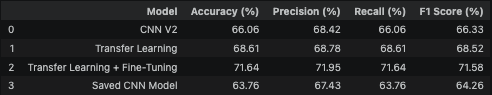

# Instituto Tecnológico y de Estudios Superiores de Monterrey Campus Querétaro
## Arturo Sánchez Rodríguez | A01275427

# OnePiece character image classification 

## Introduction
In this project we have an objective to prepare a dataset full of images of OnePiece characters for a future model image classification. The means to this project is to transform the original images into numerical data that can be used by a Machine Learning model or Deep Learning (both are good with dealing with images).
In this stage of the project we are working primarly with the selection of the dataset, image loading, train and test splitting, and the necessary preprocessing steps needed before building a classification model.

## Dataset
The dataset that we used in this project contains images of One Piece characters that are organized into folders and each folder represents a different class, which means that its a different character.
### The general structure of the dataset is as follows:
- OnePiece/Data/Data
-   Ace/
-   Akainu/
-   Brook/
-   Chopper/
-   Crocodile/
-   Franky/
-   Jinbei/
-   Kurohige/
-   Law/
-   Luffy/
-   Mihawk/
-   Nami/
-   Rayleigh/
-   Robin/
-   Sanji/
-   Shanks/
-   Usopp/
-   Zoro/

 The dataset contains a total of 11,737 images distributed across 18 classes (characters).
This dataset was selected because it contains a large number of labeled images that belong to different classes, and the objective of this project is to classify images of different characters organized into separate folders makes it possible to train a supervised learning model.
 You can download the Dataset here: [One Piece Image Classifier](https://www.kaggle.com/datasets/ibrahimserouis99/one-piece-image-classifier).

## Models

1. [Model 1 - MLP Baseline](Modelo_1.md)

2. [Model 2 - CNN](Modelo_2.md)

3. [Model 3 - Transfer Learning](Modelo_3_TL.md)

4. [Model 4 - Transfer Learning + Fine-Tuning](Modelo_4_TF_FT.md)

## Final Models comparison

The results show a consistent improvement on every stage of the project, the best overall score was with Transfer Learning and Fine Tuning reaching `71.64%` accuracy, f1-Score of `71.58%`. Fine-Tuning allowed us to adapt and use to our advantage the pre-trained features of the specific dataset (OnePiece), resulting in a better generalization of OnePiece images and its classification performance. 

The paper we selected reports a deeper CNN architecture and TL approach allowing and having a better image classification than shallow CNN models. This project follows the same path, the baseline CNN model had a low performance, Transfer Learning and Fine-Tuning kept on improving its accuracy, precision, recall and f1-score.
 
Even though there are very different datasets the findings and results that were obtained support the conclusions presented in the paper, deep architecture and TL techniques represents better feature extraction of image patterns and it improves overall classification performance.

# Selected Paper
The selected paper evaluates the performance of different deep learning architectures for image classification jut like our case og image classification with 18 classes.
This paper was selected because it follows a very strategic methodology and it is very simmilar to the one used in this project:
- Image classification
- Convolutional Neural Networks
- Accuracy 
- Recall
- F1-score
- Confusión matrix
Even though the datasets are different, this paper gives us a very useful reference of comparison and evaluating and improvising CNN-based image classification models.

# References
- One Piece Image Classifier Dataset.
Kaggle.
https://www.kaggle.com/datasets
- TensorFlow Developers.
TensorFlow Documentation.
https://www.tensorflow.org/
- Keras Developers.
Keras Documentation.
https://keras.io/
- Alem, A., & Kumar, S. (2022).
Deep Learning Models Performance Evaluations for Remote Sensed Image Classification.
IEEE Access, 10, 111784–111793.
https://doi.org/10.1109/ACCESS.2022.3215264
- Simonyan, K., & Zisserman, A. (2015).
Very Deep Convolutional Networks for Large-Scale Image Recognition.
International Conference on Learning Representations (ICLR).
https://arxiv.org/abs/1409.1556
- Mikołajczyk, A., & Grochowski, M. (2018).
Data Augmentation for Improving Deep Learning in Image Classification Problem.
2018 International Interdisciplinary PhD Workshop (IIPhDW).
IEEE.
https://doi.org/10.1109/IIPHDW.2018.8388338
- Tan, M., & Le, Q. V. (2019).
EfficientNet: Rethinking Model Scaling for Convolutional Neural Networks.
Proceedings of the 36th International Conference on Machine Learning (ICML).
https://arxiv.org/abs/1905.11946

